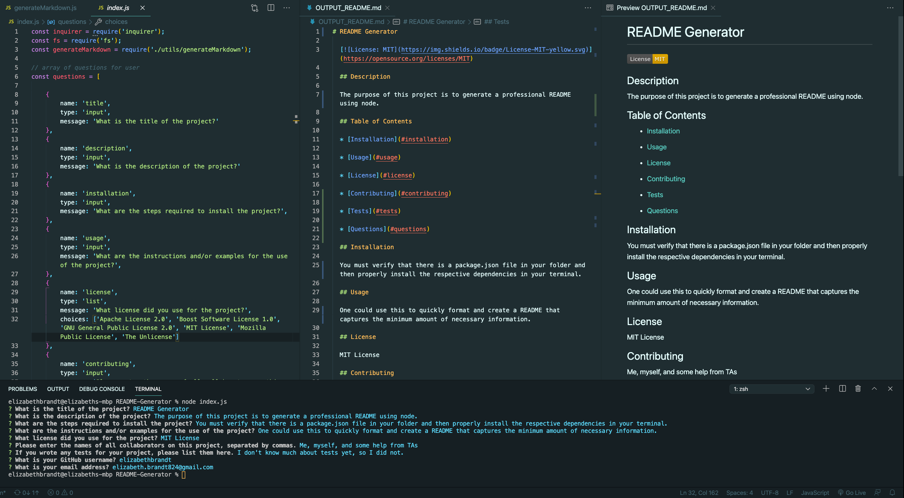

# README-Generator

## Description

The purpose of this project is to create an application that will allow the user to generate a professional README file simply by answering certain questions in the terminal.

## Table of Contents

* [Links](#links)

* [Usage](#usage)

## Links

* [GitHub Repo](https://github.com/elizabethbrandt/README-Generator)

* [Walkthrough Video on YouTube](https://youtu.be/ei4uxBv0_BE)

## Usage

This can be used as a way to make sure that your README is done efficiently and quickly, while still ensuring that you are capturing all the  categories, information, and elements that are necessary to make for a good README. I would likely adapt this a little bit differently to make this usable for myself in the context of this class (i.e. add a category for links, learning outcomes, languages, etc.), but this is great for an experienced programmer.

Below is a screenshot that displays:

* The `index.js` file displaying the `questions` variable

* The terminal at the bottom that shows that the questions were displayed and answered in the command line

* The `OUTPUT-README.md` that was generated from those questions and answered

* The Preview view of `OUTPUT-README.md` that shows how it's displayed in preview mode

## Learning Outcomes

#### Modular Code

I think this is one of my favorite things that I learned from this activity. I like that having code that you can use and import elsewhere allows you to keep your code clean and simple. It would also make it easier to isolate and test issues that way.

#### Template Literals

Though this is definitely not the first time I've used template literals, I've never used it to this extent. It was really nice becuase it makes your view of your output very explicit and easily dictated.

#### Multiple Functions within Template Literals

I also liked to keep the code clean by creating the functions below the template literal, and then just place the function into the template literal. This made that actual template much smaller and easier to view. Then it was just a matter of passing the respective values within those functions.

## Conclusion

Overall, I actually really enjoyed this homework assignment. I felt that it was really straightforward and helped us apply what we learned last week in a really nice way.